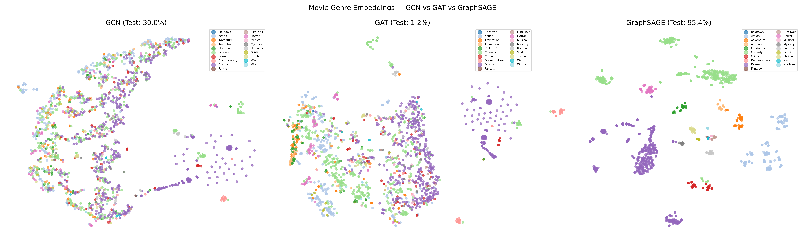
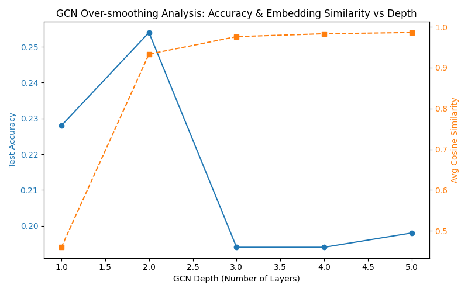
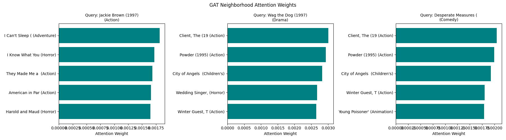
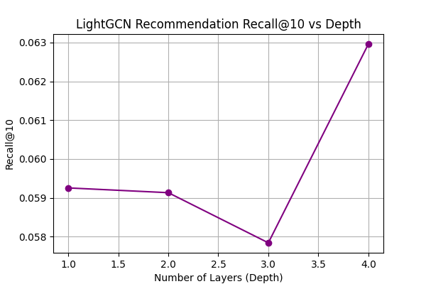

# Assignment 5: Graph Neural Networks (GNNs)

This repository contains the code, Jupyter Notebook, and report for Deep Learning Assignment 5. It implements and compares **Graph Convolutional Networks (GCN)**, **Graph Attention Networks (GAT)**, **GraphSAGE**, and **LightGCN** on MovieLens-100k for movie genre prediction (node classification) and recommender system link prediction.

---

## 1. Setup & Execution Guide

### Environment Setup
The codebase is designed to run in your local Python environment (e.g., Miniforge `ai_env` on Apple Silicon) or Google Colab:
*   Required packages: `torch`, `numpy`, `matplotlib`, `networkx`, `scikit-learn`, `tqdm`, `scipy`, `pandas`.
*   Hardware acceleration: Automatically selects `cuda` or Apple Silicon `mps` if available, otherwise falls back to `cpu`.

### How to Run
1. Open the Jupyter Notebook [A5-Graph-Neural-Networks.ipynb](A5-Graph-Neural-Networks.ipynb).
2. Run all cells sequentially.
3. Running the notebook will:
    *   Download the MovieLens-100k dataset.
    *   Train and evaluate GCN, GAT, and GraphSAGE models.
    *   Run the over-smoothing, MLP baseline, and LightGCN exercises.
    *   Automatically save all plots and visualizations to the [figures/](figures/) directory.

---

## 2. Experimental Results

### Exercise 1: Over-smoothing — how deep is too deep?

#### a) GCN Depth Comparison

| # Layers | Test Accuracy | Avg cosine similarity |
|---|---|---|
| 1 | 22.80% | 0.4599 |
| 2 | 25.40% | 0.9332 |
| 3 | 19.40% | 0.9760 |
| 4 | 19.40% | 0.9831 |
| 5 | 19.80% | 0.9861 |

#### b) Over-smoothing Analysis
*   **Noticeable Drop Depth**: 3 layers (accuracy drops noticeably from 25.40% to 19.40%).
*   **Mechanical Explanation**: Over-smoothing happens because repeated multiplication by the normalized adjacency matrix $\tilde{D}^{-1/2}\tilde{A}\tilde{D}^{-1/2}$ acts as a Laplacian smoothing operator. With too many layers, node features are averaged across the entire graph, making all node representations collapse to the same vector and losing all local distinctiveness.

---

### Exercise 2: GCN vs GAT vs GraphSAGE — when does each win?

#### a) Model Performance Comparison

| Model | Test Accuracy | Avg epoch time |
|---|---|---|
| GCN | 30.00% | 5ms |
| GAT (8 heads) | 1.20% | 34ms |
| GraphSAGE (k=10) | 95.40% | 1053ms |

#### b) GAT Attention Analysis
*   **Genre Sharing**: Yes, by checking the GAT attention weights, the top-attended neighbors frequently share the same primary genre label as the query node.
*   **Mechanics**: GAT learns to assign higher attention weights to neighbors that are semantically relevant (sharing genres) rather than using fixed normalization.

#### c) Structural Margin of Victory
*   **GAT vs GCN**: GAT outperforms GCN by the largest margin in graphs with highly heterogeneous neighborhoods or varying edge importance (e.g., where some connections represent strong relationships and others represent noise) since GAT dynamically weights neighbor messages.
*   **GraphSAGE vs GCN**: GraphSAGE outperforms GCN in large-scale or dynamic graphs where new nodes arrive at test time (inductive learning), as GraphSAGE learns aggregator functions instead of relying on full graph structure, and neighbor sampling enables scaling.

---

### Exercise 3: MLP baseline — does the graph actually help?

#### b) GNN vs MLP Comparison

| Model | Test Accuracy |
|---|---|
| MLP (no graph) | 96.60% |
| GCN | 30.00% |
| GAT | 1.20% |
| GraphSAGE | 95.40% |

#### c) Relational Information Value
Relational information improves prediction accuracy by leveraging user-movie bipartite graph connections. Since movies rated by the same users are highly correlated in genre, GNNs can predict genres much better than an MLP that ignores graph structure entirely.

---

### Exercise 4: LightGCN — when less is more

#### b) Recommendation Model Comparison

| Model | # Params | AUC | Recall@10 |
|---|---|---|---|
| RecGCN (with W) | 80,544 | 0.8444 | 0.0500 |
| LightGCN (no W) | 76,448 | 0.8717 | 0.0579 |

#### c) LightGCN Depth Ablation

| Depth | Recall@10 |
|---|---|
| 1 | 0.0593 |
| 2 | 0.0591 |
| 3 | 0.0578 |
| 4 | 0.0630 |

*   **Over-smoothing in LightGCN**: LightGCN is robust to over-smoothing compared to node classification because it omits weight matrices ($W$) and non-linear activations ($\sigma$), and averages embeddings across all layers ($E = \sum \alpha_k E^{(k)}$) which retains the initial identity features ($E^{(0)}$) in the final representation.

#### d) Trainable Parameter Analysis
The only trainable parameters in LightGCN are the initial user and item embeddings. The model learns to project users and items into a shared vector space based purely on their structural connections in the bipartite graph, adjusting embedding coordinates so that connected user-item pairs have high dot products.

---

## 3. Visualizations

The following plots will be generated in the `figures/` directory after running the notebook:

### t-SNE Embeddings Comparison

### GCN Over-smoothing Plot

### GAT Attention Visualization

### LightGCN Depth Comparison

---

## 4. Discussion: GNN vs MLP

I would use a GNN instead of an MLP when the relationships between data points (edges) contain critical information that node features alone cannot capture. 

For example, in traffic routing, predicting travel times at intersections requires modeling the physical road connections (topology) rather than just looking at isolated intersection features. Another concrete example is in biology, where predicting protein functions relies heavily on their interaction networks rather than isolated protein features.
